<h1 align="center">🚀 Auto Facebook Group Creator</h1>

<p align="center">
  
  
  
</p>

<p align="center">
  
</p>

---

## 📌 Sobre o Projeto
O **Auto Facebook Group Creator** é um script em Python que:
1. **Carrega cookies salvos** para logar automaticamente no Facebook.
2. **Pula toda a parte de login manual**.
3. **Vai direto para a página de criação de grupos**.

Feito para **ganhar tempo** e evitar processos repetitivos.

---

## 🛠️ Tecnologias
- **Python 3.8+**
- **Selenium WebDriver**

---

## 📊 Fluxo de Funcionamento

```mermaid
graph TD;
    A[Início do Script] --> B[Carregar Cookies do Facebook];
    B --> C[Login Automático];
    C --> D[Ir para Página de Criação de Grupos];
    D --> E[Fim - Usuário Pronto para Criar o Grupo];
```



---

## ⚙️ Como Usar

1️⃣ **Ativar o ambiente virtual**
```bash
source venv/bin/activate
```

2️⃣ **Rodar o script**
```bash
python main.py
```

---

## 📁 Estrutura do Projeto
```
📂 seu-projeto
 ├── main.py          # Script principal
 ├── cookies.json     # Cookies do Facebook (NÃO compartilhar)
 ├── loading.py 
 ├── mensagem.txt
 ├── config.json
 ├── nomes.txt (vai funcionar no proximo commit
 ├── logs/grupo.log(oque ta acontecendo terminal)
 ├── venv/            # Ambiente virtual
 └── README.md        # Documentação
```

---

## ⚠️ Avisos
- **Não** compartilhe seu `cookies.json`.
- O uso desse script pode violar os termos de serviço do Facebook.
- Este projeto é **para fins educacionais**.

---

<p align="center">
  
</p>

---

## 📜 Licença
Este projeto está sob a licença Apoloundifinied and Snnow
